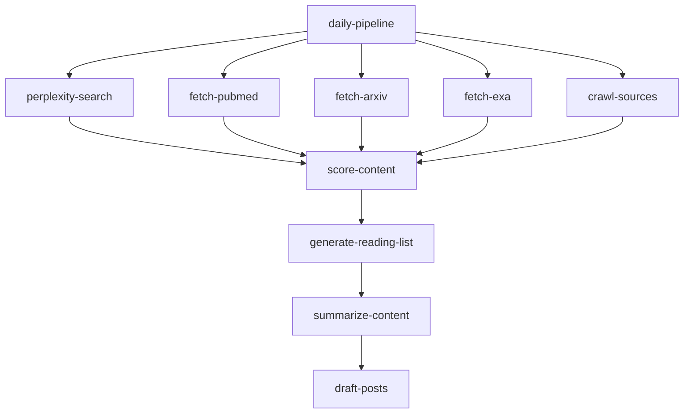

# Healthcare AI Daily

> AI-powered content curation platform for healthcare and AI research professionals. Automatically aggregates, scores, and summarizes content from scientific journals, news sources, and research databases.


## Features

### 📚 Intelligent Reading List
- **Daily curated content** from PubMed, arXiv, and configured news sources
- **Relevance scoring** using AI-powered content analysis
- **Academic metadata** including DOI, PMID, citation counts, and abstracts
- **Publication type badges** (Peer-Reviewed, Preprint, News)
- **Progress tracking** for daily reading goals

### 🔬 Scientific Publications
- **PubMed integration** - Full abstracts, MeSH terms, DOI extraction
- **arXiv integration** - Preprints with PDF links and author data
- **Citation lookup** via OpenAlex API
- **Copy citations** in AMA/APA formats

### 💼 LinkedIn Post Drafts
- **AI-generated drafts** based on top daily content
- **Edit and refine** before copying to clipboard
- **Multiple post types** (insight, thread, question)

### 📊 Source Analytics
- **Performance tracking** for configured sources
- **Average relevance scores** by source
- **Content volume metrics**

### ⚙️ Configurable Pipeline
- **Manual or scheduled** content refresh
- **Source management** with priority weights
- **Scientific publication filters** (preprints, citations, impact)

---

## Tech Stack

| Layer | Technology |
|-------|------------|
| **Frontend** | React 18, TypeScript, Tailwind CSS |
| **UI Components** | shadcn/ui, Radix UI, Lucide Icons |
| **State Management** | TanStack Query, React Hooks |
| **Backend** | Supabase (Lovable Cloud) |
| **Edge Functions** | Deno (Supabase Functions) |
| **AI/ML** | Lovable AI (Gemini, GPT) |
| **Data Sources** | PubMed, arXiv, Exa AI, Perplexity |

---

## Getting Started

### Prerequisites

- Node.js 18+ and npm
- Git

### Local Development

```bash
# Clone the repository
git clone <YOUR_GIT_URL>
cd <YOUR_PROJECT_NAME>

# Install dependencies
npm install

# Start development server
npm run dev
```

The app will be available at `http://localhost:5173`

### Environment Variables

The following environment variables are automatically configured by Lovable Cloud:

| Variable | Description |
|----------|-------------|
| `VITE_SUPABASE_URL` | Supabase project URL |
| `VITE_SUPABASE_PUBLISHABLE_KEY` | Supabase anon key |

For edge functions, these secrets may be required:

| Secret | Required | Description |
|--------|----------|-------------|
| `PERPLEXITY_API_KEY` | Optional | For Perplexity search discovery |
| `EXA_API_KEY` | Optional | For Exa AI research search |
| `FIRECRAWL_API_KEY` | Optional | For web crawling configured sources |

---

## Project Structure

```
├── src/
│   ├── components/
│   │   ├── dashboard/        # Reading list, draft posts
│   │   ├── layout/           # Navbar, Layout wrapper
│   │   ├── papers/           # Academic paper components
│   │   ├── sources/          # Source management, analytics
│   │   └── ui/               # shadcn/ui components
│   ├── hooks/                # Custom React hooks
│   ├── integrations/         # Supabase client (auto-generated)
│   ├── lib/                  # Utilities
│   └── pages/                # Route pages
│       ├── Index.tsx         # Daily reading list
│       ├── LinkedIn.tsx      # Draft posts management
│       ├── Sources.tsx       # Source configuration & analytics
│       ├── Saved.tsx         # Saved articles
│       ├── History.tsx       # Past reading lists
│       └── Settings.tsx      # App preferences
├── supabase/
│   └── functions/            # Edge functions (Deno)
│       ├── daily-pipeline/   # Orchestrates all pipeline steps
│       ├── fetch-pubmed/     # PubMed API integration
│       ├── fetch-arxiv/      # arXiv API integration
│       ├── fetch-exa/        # Exa AI search
│       ├── fetch-paper-details/  # Citation lookup
│       ├── perplexity-search/    # Discovery search
│       ├── crawl-sources/    # Web scraping
│       ├── score-content/    # Relevance scoring
│       ├── generate-reading-list/  # List curation
│       ├── summarize-content/     # AI summaries
│       ├── draft-posts/      # LinkedIn post generation
│       └── cleanup-old-data/ # Data retention
└── public/                   # Static assets
```

---

## Database Schema

### Core Tables

| Table | Description |
|-------|-------------|
| `sources` | Configured content sources (URLs, types, priorities) |
| `content_items` | Scraped articles with metadata and scores |
| `reading_lists` | Daily reading list containers |
| `reading_list_items` | Items in each reading list (ranked) |
| `draft_posts` | Generated LinkedIn post drafts |
| `pipeline_runs` | Pipeline execution history |
| `perplexity_searches` | Search discovery logs |

### Academic Metadata (content_items)

| Column | Type | Description |
|--------|------|-------------|
| `doi` | TEXT | Digital Object Identifier |
| `pmid` | TEXT | PubMed ID |
| `arxiv_id` | TEXT | arXiv identifier |
| `abstract` | TEXT | Full abstract text |
| `citation_count` | INTEGER | Citation count from OpenAlex |
| `journal_name` | TEXT | Source journal name |
| `publication_type` | TEXT | peer-reviewed, preprint, news |
| `mesh_terms` | TEXT[] | Medical Subject Headings |
| `pdf_url` | TEXT | Direct PDF link |

---

## Edge Functions

### Daily Pipeline Flow



### Function Reference

| Function | Trigger | Description |
|----------|---------|-------------|
| `daily-pipeline` | Manual/Scheduled | Orchestrates full pipeline |
| `fetch-pubmed` | Pipeline | Fetches PubMed articles with abstracts |
| `fetch-arxiv` | Pipeline | Fetches arXiv preprints |
| `fetch-paper-details` | On-demand | Fetches citation counts |
| `score-content` | Pipeline | AI-based relevance scoring |
| `draft-posts` | Pipeline | Generates LinkedIn drafts |

---

## Usage

### Running the Pipeline

1. Navigate to **Settings** page
2. Click **Run Pipeline Now**
3. Wait 2-5 minutes for completion
4. View curated content on the **Reading List**

### Managing Sources

1. Go to **Sources** page
2. Click **Add Source** to add news sites or journals
3. Use **Bulk Import** for multiple sources
4. View performance in **Analytics** tab

### Configuring Scientific Preferences

In **Settings > Scientific Publications**:
- Toggle peer-reviewed vs preprint inclusion
- Set minimum citation count filter
- Enable high-impact journal boosting

---

## Development

### Available Scripts

```bash
npm run dev      # Start development server
npm run build    # Build for production
npm run preview  # Preview production build
npm run lint     # Run ESLint
```

### Adding Components

This project uses [shadcn/ui](https://ui.shadcn.com/). To add components:

```bash
npx shadcn-ui@latest add <component-name>
```

### Code Style

- TypeScript with strict mode
- Functional components with hooks
- Tailwind CSS with semantic design tokens
- Component-driven architecture

---

## Deployment

### Via Lovable

1. Open the project in [Lovable](https://lovable.dev)
2. Click **Share → Publish**
3. Your app is live!

### Custom Domain

1. Go to **Project Settings → Domains**
2. Click **Connect Domain**
3. Follow DNS configuration instructions

---

## Contributing

1. Fork the repository
2. Create a feature branch (`git checkout -b feature/amazing-feature`)
3. Commit changes (`git commit -m 'Add amazing feature'`)
4. Push to branch (`git push origin feature/amazing-feature`)
5. Open a Pull Request

---

## License

This project is private. All rights reserved.

---

## Support

- [Lovable Documentation](https://docs.lovable.dev)
- [Lovable Discord](https://discord.com/channels/1119885301872070706/1280461670979993613)

---

Built with ❤️ using [Lovable](https://lovable.dev)
